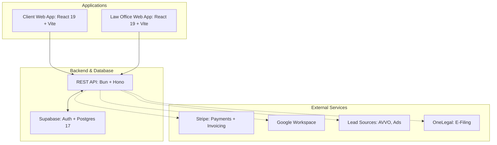
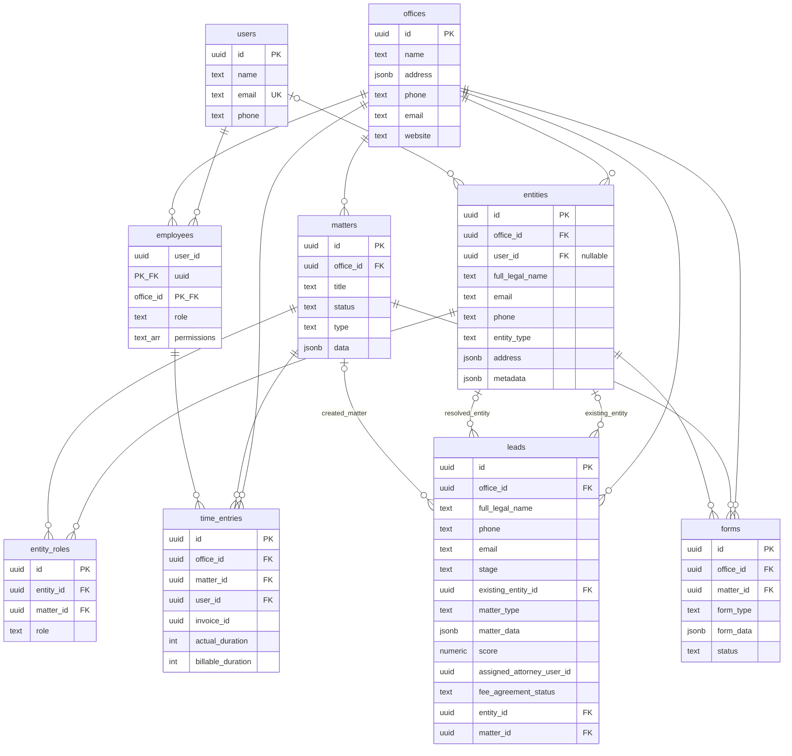
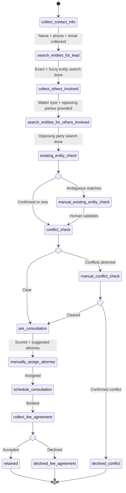
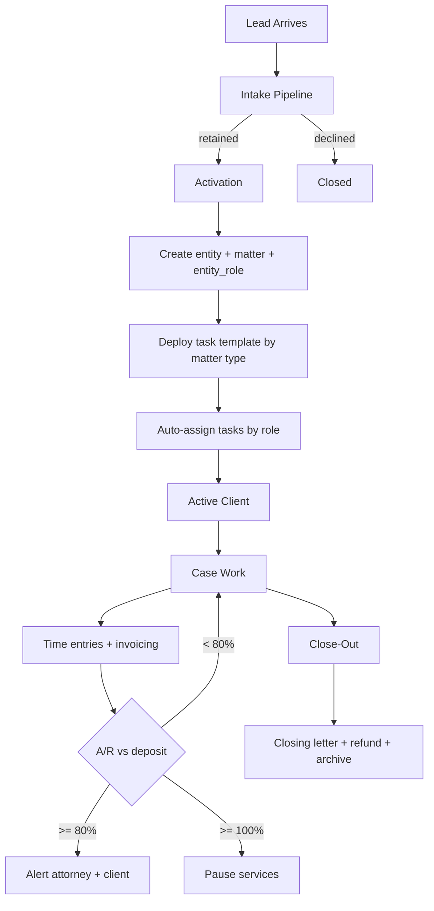
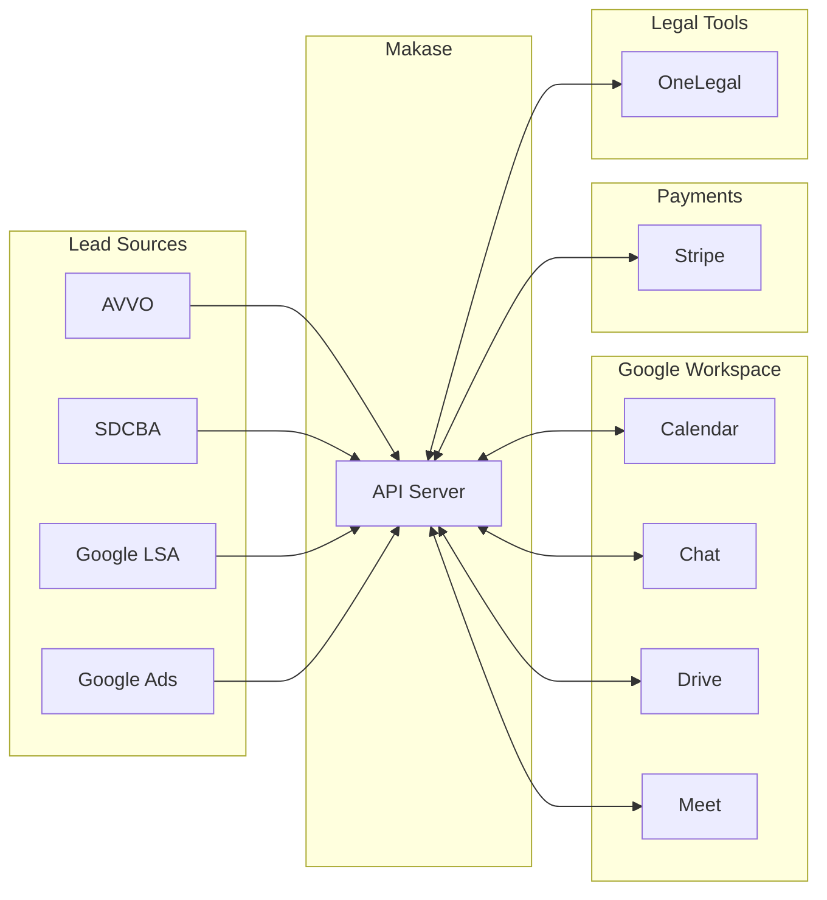

# Makase Law -- Technical Overview

## 1. System Architecture

| Layer    | Technology                            |
| -------- | ------------------------------------- |
| Runtime  | Bun                                   |
| API      | Hono v4                               |
| Database | Postgres 17 (Supabase)                |
| ORM      | Kysely + kysely-postgres-js           |
| Auth     | Supabase Auth (JWT, OTP)              |
| Frontend | React 19, Vite 8, Tailwind v4, wouter |
| UI       | Base UI + shadcn-style primitives     |
| PDF      | pdf-lib                               |
| Types    | kysely-codegen                        |

### Multi-Office Scoping

Tresp operates two firms (Tresp Law, APC and Tresp, Day & Associates). Each is a row in `offices`. Every domain table carries an `office_id` FK that scopes all data per firm. Users link to offices via `employees` with a composite PK `(user_id, office_id)`, each carrying a `role` and `permissions[]` array. A single user can belong to both offices with different roles.

---

## 2. Data Model

### Design Decisions

- `**entities` as universal registry.** Everyone -- clients, opposing parties, witnesses, experts, attorneys -- is an `entity`. Their role in a specific matter is defined by `entity_roles`. This powers the conflict check system from a single table.
- `**pg_trgm` fuzzy search.** GIN index on `entities.full_legal_name` enables similarity-based name matching during conflict checks.
- `**leads` as a state machine.** The `stage` column (15 valid stages via CHECK constraint) drives the entire intake pipeline. All intermediate data (search results, conflict data, scores) lives on the lead row.
- **Generic JSONB forms.** `forms.form_data` stores arbitrary form payloads keyed by `form_type`. New form types require no schema migration.
- **Soft deletes.** All tables carry `deleted_at` / `deleted_by`. A shared `update_updated_at()` trigger keeps timestamps current.

---

## 3. Lead Intake Pipeline

### Stage Detail

| Stage                                 | Type              | What Happens                                                                                                                                 | Tables                                            |
| ------------------------------------- | ----------------- | -------------------------------------------------------------------------------------------------------------------------------------------- | ------------------------------------------------- |
| `collect_contact_info`                | Automated + wait  | Collect name, phone, email. Notify firm on arrival.                                                                                          | W: `leads`                                        |
| `search_entities_for_lead`            | Automated         | Exact match on phone/email, fuzzy match on name via `pg_trgm`. Load `entity_roles` for each match.                                           | R: `entities`, `entity_roles` / W: `leads`        |
| `collect_others_involved`             | Wait for input    | Collect `matter_type`, `opposing_party_names`, `other_entity_names`. Ethically constrained -- no confidential details before conflict check. | W: `leads`                                        |
| `search_entities_for_others_involved` | Automated         | Same entity search for each opposing party / other entity. Store in `conflict_search_results`.                                               | R: `entities`, `entity_roles` / W: `leads`        |
| `existing_entity_check`               | Automated         | Route: exact match + no fuzzy ambiguity -> pass. Ambiguous matches -> manual. No matches -> pass (new person).                               | W: `leads`                                        |
| `manual_existing_entity_check`        | Human gate        | Staff picks existing entity or confirms new person. Sets `existing_entity_check_passed_by`.                                                  | W: `leads`                                        |
| `conflict_check`                      | Automated         | Check if lead's entity has non-client roles in prior matters. Check if opposing parties have roles in prior matters. Any hit -> manual.      | W: `leads`                                        |
| `manual_conflict_check`               | Human gate        | Staff reviews flagged conflicts. Clear -> proceed. True conflict -> `declined_conflict`.                                                     | W: `leads`                                        |
| `pre_consultation`                    | Wait for input    | Collect matter-type-specific data (confidential, post-conflict-check). Score lead, suggest attorney.                                         | W: `leads`                                        |
| `manually_assign_attorney`            | Human gate        | Confirm/override attorney assignment. Send scheduling link.                                                                                  | W: `leads`                                        |
| `schedule_consultation`               | Wait for booking  | Per-attorney Google Calendar link sent. Fee agreement auto-sent on booking.                                                                  | W: `leads`                                        |
| `collect_fee_agreement`               | Wait for response | Accepted -> `retained` (create entity + matter + entity_role). Declined -> `declined_fee_agreement`.                                         | W: `leads`, `entities`, `matters`, `entity_roles` |

---

## 4. Client Lifecycle

**Activation trigger:** Fee agreement signed AND payment received (via Stripe). At that point: create `entities` row (or link existing), create `matters` row with type from fee agreement, create `entity_roles` with `role = 'client'`, deploy task template, auto-assign tasks, send notification.

**Close-out:** AI-drafted closing letter (attorney reviews), deposit refund calculated from billing record, refund via original payment method, matter status -> `archived`.

---

## 5. Module Map

### Lead Capture & Intake

|            |                                                                                  |
| ---------- | -------------------------------------------------------------------------------- |
| **Tables** | `leads`, `entities`, `entity_roles`, `matters`                                   |
| **Routes** | Planned: CRUD + stage transitions on `/office/leads`                             |
| **Apps**   | Client (intake forms, AI assistant) + Office (review queue, conflict resolution) |

24/7 AI intake assistant (SMS + web). Multi-source auto-capture with source tagging (AVVO, SDCBA, Google LSA/Ads, referrals). Automated conflict check via `pg_trgm` fuzzy search + exact match. Lead scoring with auto-send scheduling link above threshold. Google conversion tracking by source.

### Scheduling & Consultations

|            |                                                      |
| ---------- | ---------------------------------------------------- |
| **Tables** | `leads`, `forms`                                     |
| **Routes** | Planned                                              |
| **Apps**   | Client (booking) + Office (notes, transcript review) |

Per-attorney Google Calendar links auto-sent on qualification. Consult agreement auto-sent on booking. AI transcription for in-person + Google Meet (summary + full transcript, attorney-editable before save).

### Fee Agreements

|            |                                      |
| ---------- | ------------------------------------ |
| **Tables** | `leads`, `forms`                     |
| **Routes** | Planned                              |
| **Apps**   | Office (drafting) + Client (signing) |

13 template variants. Required fields: firm entity (TDA vs TL), matter type, billing type, start date, referral source, deposit, scope, office location, assigned attorney. Matter type drives task template deployment. E-signatures via Google Drive (replaces Adobe Sign). Future: AI auto-suggest template from consult transcript.

### Payment & Activation

|            |                                                |
| ---------- | ---------------------------------------------- |
| **Tables** | `leads`, `entities`, `matters`, `entity_roles` |
| **Routes** | Planned: Stripe webhooks, activation endpoint  |
| **Apps**   | Client (payment page) + Office (confirmation)  |

Stripe integration (Apple Pay, Google Pay, Stripe Link). Auto-redirect to payment after signing. Automated reminders via text + email. Client ID assigned only when signed + paid. On activation: create entity/matter/entity_role, deploy task template, assign tasks, notify.

### Case Management

|            |                                                                                          |
| ---------- | ---------------------------------------------------------------------------------------- |
| **Tables** | `matters`, `entity_roles`, `entities`, `forms`                                           |
| **Routes** | `GET/POST /office/matters`, `GET/PATCH /office/matters/:id` (exist); task routes planned |
| **Apps**   | Office                                                                                   |

7-stage Kanban pipeline. Task templates per matter type deployed on activation. Attorney portfolio view with financial health (color-coded A/R). `matters.data` JSONB stores type-specific fields. Google Chat for matter-linked messaging (replaces Flock). Weekly AI case summaries. AI meeting notes. Call tracking with recording + transcript (TCPA compliant). Calendar + deadline tracking (replaces Deadlines.com).

### Time Tracking

|            |                                                            |
| ---------- | ---------------------------------------------------------- |
| **Tables** | `time_entries`, `employees`, `matters`                     |
| **Routes** | Planned: CRUD on `/office/time-entries`, approval workflow |
| **Apps**   | Office                                                     |

Start/stop timer + manual entry. `actual_duration` vs `billable_duration` (rounding to next minute). `(user_id, office_id)` FK to `employees` enforces office membership. `invoice_id` FK links to invoices once billed. Rate card by role (Principal, Paralegal, Associate, Admin) -- needs new table or config. Submit + approve workflow. Future: AI-suggested timesheet from platform activity.

### Billing & Invoicing

|            |                                                                         |
| ---------- | ----------------------------------------------------------------------- |
| **Tables** | `time_entries`; planned: `invoices`, `invoice_line_items`, `rate_cards` |
| **Routes** | Planned                                                                 |
| **Apps**   | Office                                                                  |

Two-stage approval: Lisa reviews -> Elizabeth final approval. Internal invoices every 2 weeks, client-facing every 4 weeks (independent cadences). Flat fee matters excluded. 5 billing states: Rendered / No Charge / Deferred / Invoiced-Unpaid / Invoiced-Paid. Line-item write-off, deferral, and waiver on a single invoice. Two-firm invoicing (TDA vs TL). A/R monitoring: alert at 80% deposit, pause at 100%. Stripe for client-facing payment. Bill dispute workflow. New tables needed for invoices, line items, rate cards, billing states.

### Client Portal

|            |                                                 |
| ---------- | ----------------------------------------------- |
| **Tables** | `matters`, `entities`, `time_entries`, `forms`  |
| **Routes** | `/client/`* (partially exist); auth/scoping TBD |
| **Apps**   | Client                                          |

Read-only: case status, documents, billing. View unbilled time since last invoice. Secure document upload to Google Drive. Needs separate auth flow (client tokens vs employee tokens) -- current `/client` routes have no auth middleware.

### Probate Workflow

|            |                                                                                                     |
| ---------- | --------------------------------------------------------------------------------------------------- |
| **Tables** | `matters`, `forms`, `entities`                                                                      |
| **Routes** | `POST/GET /client/forms/form_de_{111,121,140}` (exist); `GET/PATCH /office/forms/form_de_`* (exist) |
| **Apps**   | Client (form wizards) + Office (review, PDF generation)                                             |

Most built-out module. Multi-step form wizards for DE-111, DE-121, DE-140 with PDF generation via pdf-lib. Planned: DE-160, DE-165, DE-295, DE-310. Small estate flag (< $184,500 -> Summary Administration). 8-milestone California Probate Code checklist. Statutory deadline auto-tracking. Attorney review routing for prefilled forms. Future: AI doc summarization for wills/trusts.

### Platform, Security & Data

|            |                                                                                 |
| ---------- | ------------------------------------------------------------------------------- |
| **Tables** | `users`, `offices`, `employees`; planned: `audit_log`, `notifications`          |
| **Routes** | `GET /auth/me`, `POST /auth/offices` (exist); audit/notification routes planned |
| **Apps**   | All                                                                             |

Mobile-first (non-negotiable). RBAC via `employees.permissions[]` -- API must enforce per route. Notification center (new lead, payment, invoice, A/R). Immutable audit log (3-year retention, append-only). Supabase Auth with MFA. TLS 1.2+ / AES-256. California State Bar compliance (Rule 1.6). TCPA compliance for call recording. Automated contact dedup via `pg_trgm` with review queue. Two-firm architecture already modeled. Data export in CSV/PDF/JSON.

---

## 6. Build Status

### Built

| Component       | Details                                                       |
| --------------- | ------------------------------------------------------------- |
| Database schema | 9 tables, indexes, triggers, RLS, `pg_trgm`                   |
| Supabase Auth   | JWT auth, OTP login, user bootstrapping                       |
| Auth API        | `GET /auth/me`, `POST /auth/offices`                          |
| Matter CRUD     | Create, list, get, update (both `/client` and `/office`)      |
| Probate forms   | DE-111, DE-121, DE-140 wizards (client) + review/PDF (office) |
| Frontend        | Auth flow, routing, session management in both apps           |

### Designed, Not Implemented

| Component            | Details                                                            |
| -------------------- | ------------------------------------------------------------------ |
| Lead intake pipeline | `leads` table + stage CHECK constraint in place. No API routes.    |
| Conflict checking    | `entities` + `entity_roles` + `pg_trgm` index ready. No API logic. |
| Intake pseudocode    | `lead-intake-plan.txt` documents full state machine.               |

### Needs Design + Implementation

Lead intake API, notification system, time tracking, billing/invoicing (new tables needed), scheduling (Google Calendar API), fee agreements (templates, e-sig), payment (Stripe webhooks, activation), client portal auth, task management (table, templates, Kanban), Google integrations (Chat, Drive, Meet), audit log, close-out workflow, AI features (transcription, summaries, meeting notes), additional probate forms (DE-160, DE-165, DE-295, DE-310).

### Known Issues

1. **No auth on `/client` and `/office` routes.** Only `/auth/`* uses `authMiddleware`. Must be fixed before production.
2. `**created_by`/`updated_by` missing in form inserts.** Client POST handlers omit these NOT NULL fields.
3. **Stale `api/README.md`.** References Deno but project runs on Bun.

---

## 7. External Integrations

| Integration                    | Purpose                                | Connection              | Status    |
| ------------------------------ | -------------------------------------- | ----------------------- | --------- |
| Supabase Auth                  | Auth, JWT, MFA                         | SDK                     | **Built** |
| Supabase Postgres              | Primary DB                             | Kysely                  | **Built** |
| Stripe                         | Payments, invoicing, Apple/Google Pay  | REST + Webhooks         | Planned   |
| Google Calendar                | Per-attorney scheduling, deadlines     | Calendar API v3         | Planned   |
| Google Chat                    | Matter-linked messaging                | Chat API                | Planned   |
| Google Drive                   | Doc storage, e-signatures              | Drive API v3            | Planned   |
| Google Meet                    | Consultation recording + transcription | Meet API                | Planned   |
| Google Ads                     | Conversion tracking, attribution       | Ads API                 | Planned   |
| AVVO / SDCBA                   | Lead capture                           | Email parsing / Webhook | Planned   |
| Google LSA                     | Lead capture                           | Ads API                 | Planned   |
| OneLegal                       | Court e-filing                         | Filing API              | Planned   |
| CEB / Westlaw / Wealth Counsel | Research tools                         | iframe / OAuth link     | Planned   |

## 8. Plan of Attack

1. leads, matters, tasks, and time tracking (asana + hubspot + big time)
2. migrate data and release v1
3. data pipeline, lead data pulled into matter, matter data used to auto generated forms (start with probate)
4. full automation of lead intake
5. fill in gaps and add nice to haves

